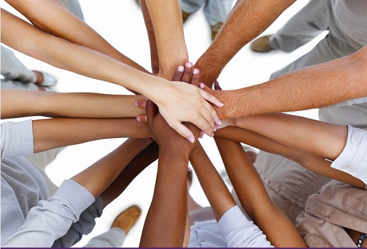

= Les 015
:source-highlighter: coderay
:revealjs_theme: serif
:revealjs_history: true

[%notitle]
== Together

[transition=zoom, %notitle, background-color=gold]
== Spel

[%step]
* Groepen van vijf
* één laptop per groep
* **geen** mobiele telefoons
* één iemand mag de laptop bedienen
* De docent mailt deze persoon de uitdaging.
* Na goedkeuring van de docent krijg je de volgende uitdaging
