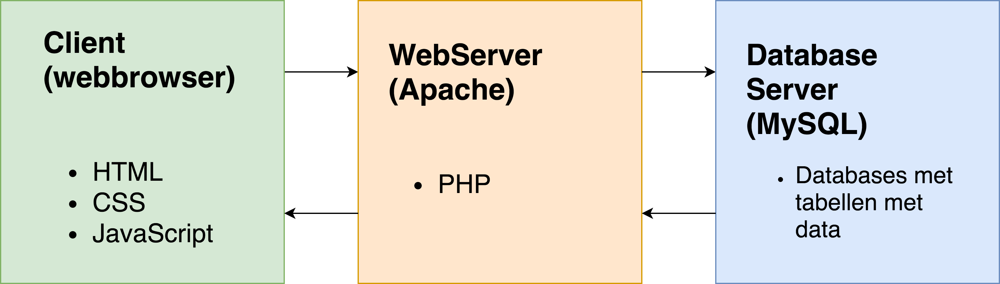

= JavaScript: een begin
:source-highlighter: coderay
:revealjs_theme: serif
:revealjs_history: true

== Doel

* Je weet hoe je JavaScript aanroept
* Je kent de verschillen in syntax tussen PHP en JavaScript
* Je ziet de overeenkomsten tussen PHP en JavaScript
* Je kunt JavaScript code (deels) lezen en begrijpen

== Programmeertaal

[%step]
* variabelen
* functies
* net zo krachtig als PHP

== Verschil met PHP

[%step]
* draait (meestal) in de browser

[%notitle]
== Overzicht

== Meest gebruikt

[source,javascript]
----
alert('hoi, ik laat een popup zien');
----

== Variabelen

[source,php]
----
<?php
// PHP:
$age = 18;
----

[source,javascript]
----
// JavaScript:
var age = 18;
----

== Strings plakken

[source,php]
----
<?php
// PHP:
$days = 214;
$msg = 'Nog ' . $days . ' dagen tot de zomervakantie';
----

[source,javascript]
----
// JavaScript:
var days = 214;
var msg = 'Nog ' + days + ' dagen tot de zomervakantie';
----

== Functies

[source,php]
----
<?php
// PHP:
function kwadraat($x) {
  return $x * $x;
}
----

[source,html]
----

----

== Apart bestand

[source,html]
----

----

== jQuery

[%step]
* Een JavaScript "library"
* Maakt veel JavaScript functionaliteit makkelijker

== jQuery voorbeeld

[source,javascript]
----
// "plain" JavaScript:
document.getElementById('demo').innerHTML = 'Hello World';

// JavaScript met jQuery:
$('#demo').html('Hello World');
----

== Developer console

[%step]
* Gebruik hem!
* Laat fouten zien
* In je browser:
  - Element inspecteren
  - Selecteer tab 'Console'
  - console.log('jouw bericht');

== Opdracht

* Los de volgende challenge op:
  - summer_hollidays_javascript.html
* JavaScript tutorial:
  https://www.w3schools.com/js/
* jQuery:
  https://jquery.com
